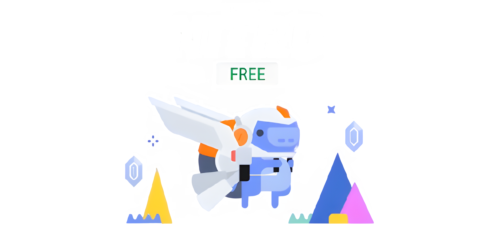

# discord-boost


## Installation

- [Node.js](https://nodejs.org/) must be installed on your operating system.

- ##### Run `npm install discord-boost` to install this package.

## Example usage

```js
const nitro = require("discord-boost");

// Set the amount of codes to generate
const amount = 100; // For example, 100 codes

/*
Specify whether to count the codes like this:
[1] https://discord.gift/...
[2] https://discord.gift/...
*/
const count = false;

const giftCodes = nitro(amount, count);
console.log(giftCodes);
```

## Links

- Subscribe to my [YouTube channel](https://www.youtube.com/channel/UClv-kdP1ORF5tHc9msY1Ggg).<br>
- Join my [Discord server](https://discord.gg/cVHDZyapMn) for help.<br>
- Follow me on [Instagram](https://instagram.com/jxrif).
